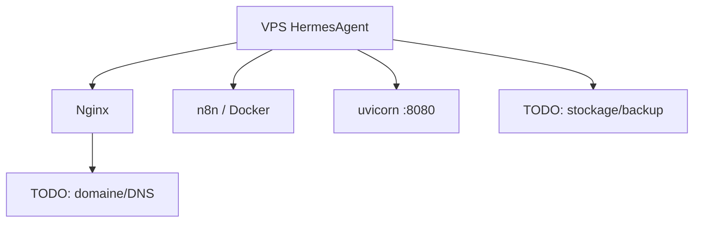

# Infrastructure Map (squelette)

```mermaid
graph TD
  VPS[VPS HermesAgent] --> Nginx
  VPS --> N8N[n8n / Docker]
  VPS --> Uvicorn[uvicorn :8080]
  VPS --> TODO_Storage[TODO: stockage/backup]
  Nginx --> TODO_Domain[TODO: domaine/DNS]
```
