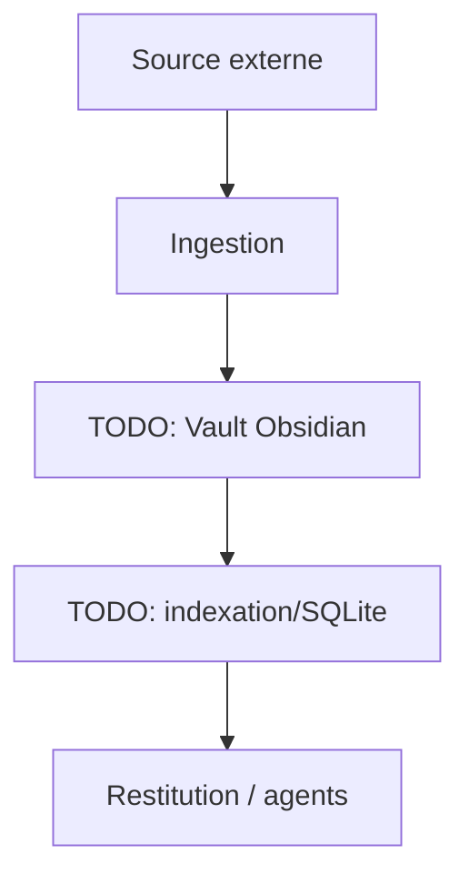

# Knowledge Flow (squelette)

```mermaid
graph TD
  Source[Source externe] --> Ingestion
  Ingestion --> TODO_Vault[TODO: Vault Obsidian]
  TODO_Vault --> TODO_Index[TODO: indexation/SQLite]
  TODO_Index --> Restitution[Restitution / agents]
```
