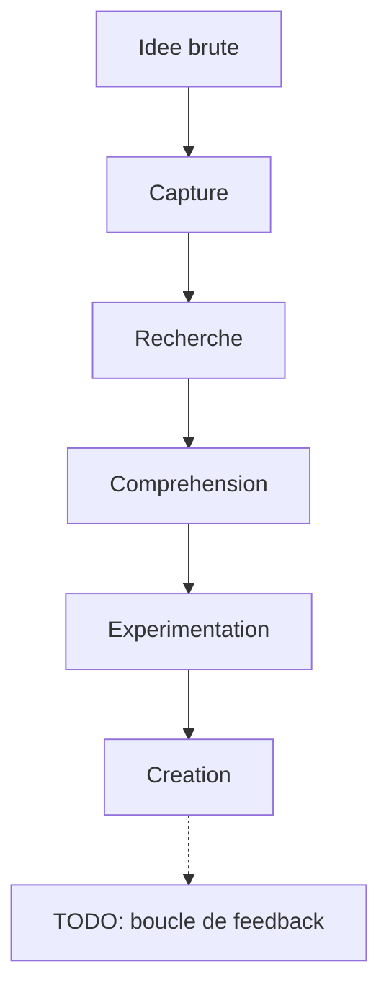

# System Map (squelette)

```mermaid
graph TD
  Idee[Idee brute] --> Capture
  Capture --> Recherche
  Recherche --> Comprehension
  Comprehension --> Experimentation
  Experimentation --> Creation
  Creation -.-> TODO_Feedback[TODO: boucle de feedback]
```
